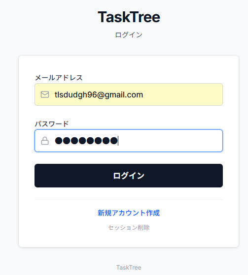
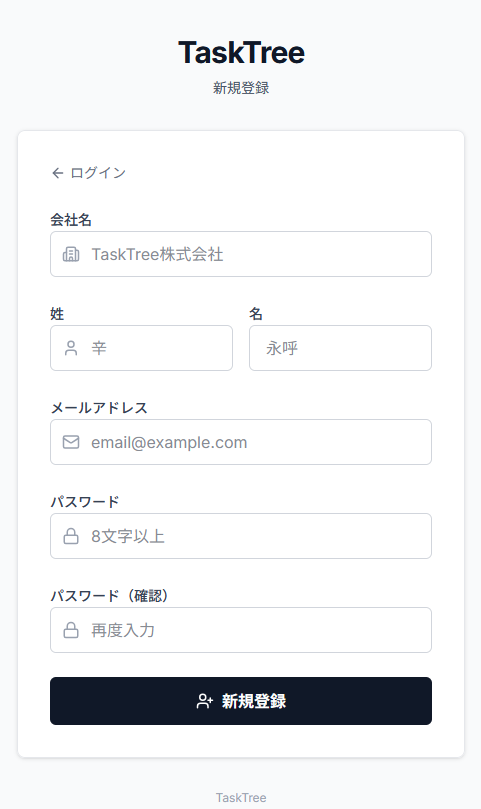
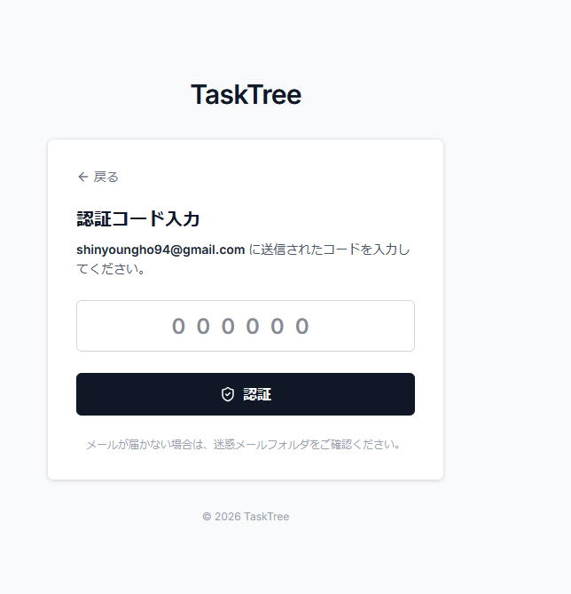
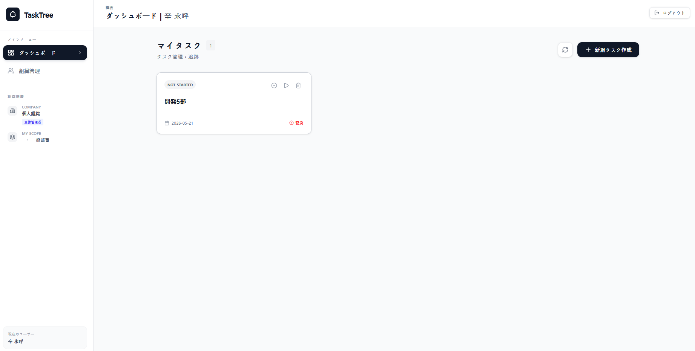
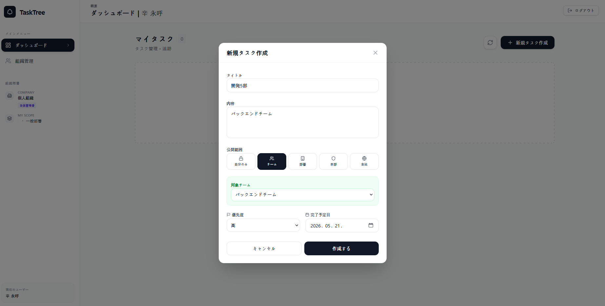
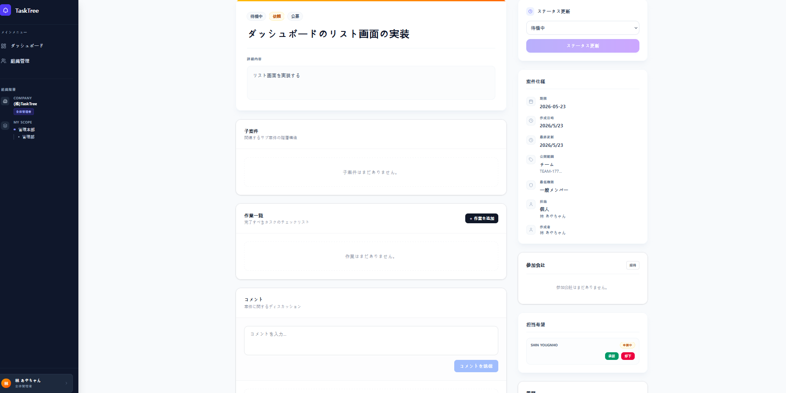
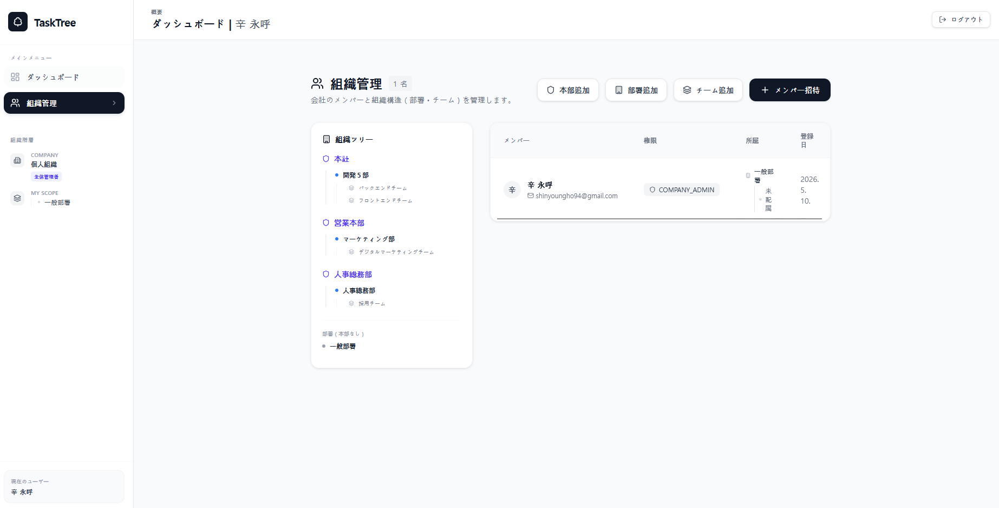
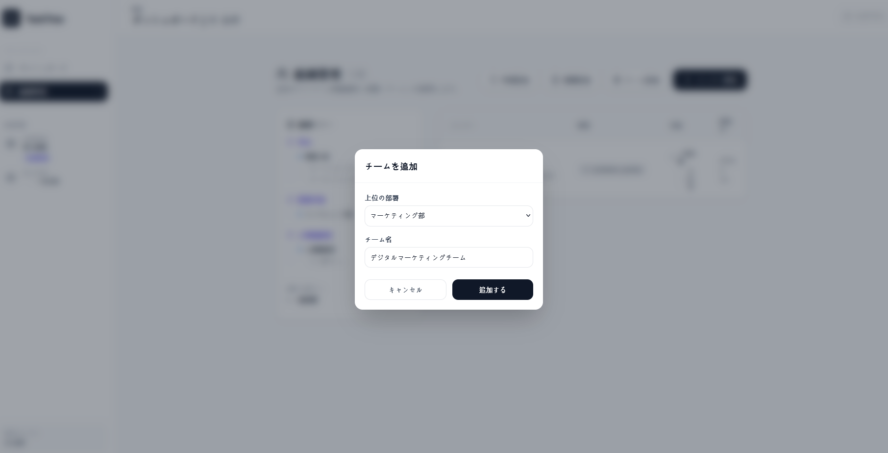
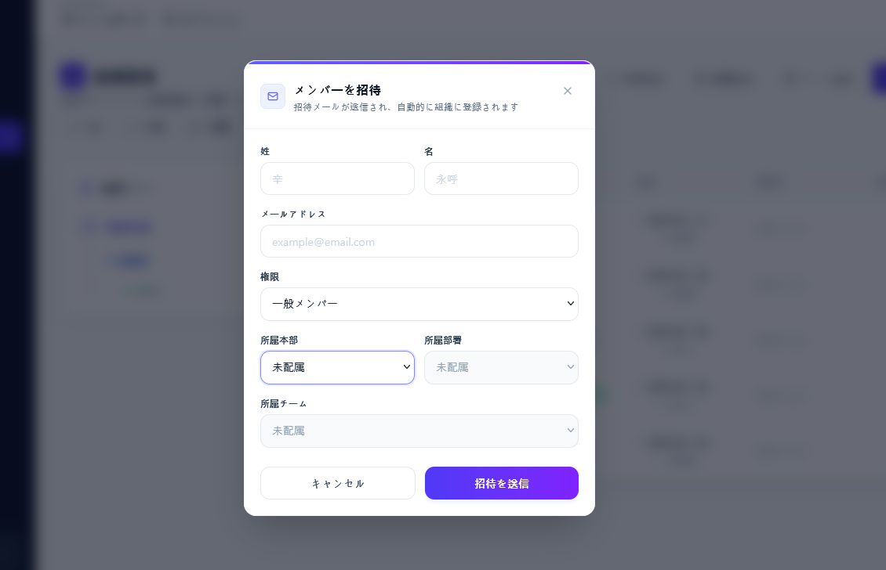

# TaskTree(ポートフォリオプロジェクト)

# プロジェクトの目的

実務で学んだ技術を基に, タスク管理用のWebアプリケーションを開発する

## 🛠️ 技術スタック

### フロントエンド

### バックエンド & クラウド

### ツール & 構成

---

## 📆 開発ログ (ヒストリー)

---

## v1.0.0 - 技術検証用

> 実務で学んだ技術を一通り形にし、認証・組織階層・タスク管理・AWS インフラを実装した初期バージョン。

### Monorepo 環境構築 (Yarn Workspaces)

  - `packages/task-core`: 共通型定義および共有ロジック
  - `packages/task-ui`: 共通 UI コンポーネントライブラリ (TailwindCSS)
  - `packages/task-app`: Next.js ベースのフロントエンドアプリケーション
  - `packages/task-api`: AWS Lambda を利用したビジネスロジック (API)
  - `packages/task-infra`: AWS CDK によるインフラ構成管理 (IaC)

### Task 1: DynamoDB の階層構造と共通機能の実装 [[PR #1]](https://github.com/SHINYOUNGHO94/TaskTree/pull/1)

  - 組織階層（会社 ➔ 事業部 ➔ 部署 ➔ チーム ➔ 社員）に合わせたデータ構造の設計
  - 共通関数 `createHierarchyRecord` によるデータ変換の自動化
  - 重複コードを排除し、安全に階層を追加できるロジックを構築

### Task 2: CI/CD 環境の構築 (ESLint, Prettier, GitHub Actions) [[PR #2]](https://github.com/SHINYOUNGHO94/TaskTree/pull/2)

  - ESLintとPrettierによるコード品質の自動管理
  - GitHub Actionsによる自動ビルドとLintチェックの自動化
  - 実務で使われる `--immutable` などの設定を適用

### Task 3: AWS インフラ構築と API 実装 (DynamoDB / API Gateway) [[PR #3]](https://github.com/SHINYOUNGHO94/TaskTree/pull/3)

  - AWS CDKによるDynamoDB、API GatewayのIaC化
  - `BaseRepository<T>` による共通ロジックの集約と型安全性の確保
  - 絶対パス（@/）の導入によるプロジェクトの可読性向上

### Task 4: AWS Cognito 連携とログイン画面の実装 [[PR #4]](https://github.com/SHINYOUNGHO94/TaskTree/pull/4)

  - AWS Cognitoによるユーザー認証基盤の構築
  - 認証ロジックを `@task/core` に集約し、フロントエンドと分離
  - `zod` と `react-hook-form` によるバリデーションとエラー表示の実装
  - ログイン状態に基づいた画面遷移とログアウト機能の実装

### Task 5: ダッシュボードの実装と API データ連携 [[PR #5]](https://github.com/SHINYOUNGHO94/TaskTree/pull/5)

  - AWS CDKによるAPI Gateway、DynamoDB、Lambdaのデプロイ
  - AWS Amplify v6 による自動認証トークン送信の設定
  - 画面のコンポーネント分割によるメンテナンス性の向上
  - タスクの新規登録および一覧表示機能の実装

### Task 6: タスク管理機能の完成と組織情報の表示 [[PR #6]](https://github.com/SHINYOUNGHO94/TaskTree/pull/6)

  - タスクのCRUD機能（作成・表示・編集・削除）をすべて実装
  - ユーザーの所属組織（会社・部署など）をサイドバーに表示
  - GSIによる高速なデータ取得とインフラの最適化

### Task 7: ユーザー登録機能の実装と認証フローの改善 [[PR #7]](https://github.com/SHINYOUNGHO94/TaskTree/pull/7)

  - Cognitoを利用したユーザー新規登録とメール認証機能の実装
  - ログイン時の画面のちらつきと無限リダイレクト問題を解決
  - ログアウト時に発生するネットワークエラー（CORS）を防止し、動作を安定化

### Task 8: 組織管理画面と招待ログインフローの完成 [[PR #8]](https://github.com/SHINYOUNGHO94/TaskTree/pull/8)

  - 組織図（部署・チーム）をツリー形式で表示するUIへ改善
  - 管理者からの招待と、初回ログイン時のパスワード変更機能を実装
  - 組織作成時のバックエンド（AWS Lambda）の権限設定を修正

### Task 9: 階層型アクセス制御の実装 [[PR #9]](https://github.com/SHINYOUNGHO94/TaskTree/pull/9)

  - 役職（社長・部長・リーダー）に応じた案件の閲覧範囲制御を実装
  - 下位組織の案件を上位管理者が一括管理できる階層型ロジックの構築
  - 作成者本人以外の編集・削除を制限するセキュリティガードの強化

---

## v1.1.0 - 設計の整理とシステムの安定化

> v1.0.0 で実装した機能を見直し、認証・権限・データ構造を安定化したバージョン。

### 設計整理と登録処理の改善 [[PR #13]](https://github.com/SHINYOUNGHO94/TaskTree/pull/13)

  - 設計の整理：データのルールを一つにまとめ、管理しやすいコードへ改善
  - データの重複防止：同じデータが二重に登録されるトラブルを防止し、正確なデータ管理を実現
  - 登録プロセスの改善：ユーザー登録時に発生していたエラーを修正し、全体の動作を安定化

### セキュリティパッチと設計の改善を適用 [[PR #14]](https://github.com/SHINYOUNGHO94/TaskTree/pull/14)

  - セキュリティの強化：認証されていないユーザーからの不正なAPIアクセスを完全に遮断
  - データベース権限の最適化：各機能が本当に必要な最小限の権限のみを持つようにインフラ設定を改善
  - コード品質の向上：テストがしやすい構造への変更と、フロントエンド・バックエンド間のデータ通信エラーを防止

### 認証とデータ構造の安定化 [[PR #15]](https://github.com/SHINYOUNGHO94/TaskTree/pull/15)

  - CognitoをCDKで自動作成できるようにし、手動設定に依存しない構成へ改善
  - フロントエンドで使う環境変数をデプロイ後に自動更新できるように修正
  - 組織データの項目名を統一し、フロントエンドとバックエンドのデータずれを解消

---

## v1.2.0 - テスト環境の構築

> Vitest と Playwright を導入し、API と画面の基本動作を検証できる状態にしたバージョン。

### 結合テストと E2E テストの追加

  - Vitestを導入し、ユーザー情報APIのレスポンス形式を確認
  - 日時データや未所属データが安全に処理されることをテストで確認
  - Playwrightを導入し、ログイン画面と新規登録画面の基本動作を確認

### コードレビューによる可読性の改善

  - コードから自明なコメントを整理し、全体の見通しを改善
  - 権限判定など意図が伝わりにくい箇所のコメントは維持
  - プロファイル取得失敗時の `console.log` を `console.error` に修正

---

## v2.0.0 - AI エージェントチームによるプロダクト品質への改善

> v1.x で実装した技術検証用ポートフォリオを、AI を積極的に活用して、実際に運用できるアプリケーション品質へ近づけるための開発フェーズ。

v1.x は、実務で学んだ技術を自分で設計・実装し、その理解を証明することを目的としたポートフォリオでした。  
AI は主に調査、エラー確認、実装時の補助として利用しましたが、設計判断、実装方針、動作確認、改善判断は自分で行っています。

そのため、認証、組織階層、権限管理、タスク管理、AWS インフラなどの主要技術は実装していますが、実際のアプリケーションとして見ると、UX、機能の完成度、エラー処理、テスト、運用性にはまだ改善余地があります。

v2.0.0 では、AI を単なるコード生成ツールとして使うのではなく、Claude、GPT/Codex、Gemini などを役割ごとのエージェントとして扱い、設計・実装・レビュー・テスト・改善提案を分担させながら開発を進めます。

具体的には、Claude を主な実装担当、GPT/Codex を検証・レビュー・補完修正担当、Gemini を広範囲の分析・アイデア出し・方針比較担当として活用します。  
それぞれのモデルの得意分野と利用可能なトークン量を考慮し、AI の使い方自体も設計対象として扱います。

このフェーズの目的は、v1.x のように AI を補助的なコーディングサポートとして使うだけではありません。  
プロジェクト全体の構造を理解した上で、プロンプト設計、作業手順、レビュー観点、検証方法を整備し、AI を一人の開発メンバーのようにコントロールしながら開発することを目指します。

### 追加した AI 開発基盤

- `AGENTS.md`: 全 AI エージェント共通の入口と基本ルール
- `CLAUDE.md`: Claude 向けの役割定義
- `GPT.md`: GPT/Codex 向けの役割定義
- `GEMINI.md`: Gemini 向けの役割定義
- `docs/core`: プロジェクト目標、現在の構成、パッケージ境界、コーディング規則
- `docs/workflow`: AI エージェントチームの作業フロー

### v2.0.0 の改善方針

- 技術検証用の実装から、実際に使えるアプリケーション体験へ改善する
- 認証、招待、組織管理、タスク管理のユーザーフローを整理する
- エラー表示、ローディング、空状態、入力バリデーションを強化する
- 権限管理とデータアクセス制御をより安全で分かりやすくする
- API、型定義、フロントエンド間のデータ契約を整理する
- Vitest と Playwright を活用し、重要な動作を継続的に検証できる状態にする
- AI による提案、実装、レビューの記録を残し、再現性のある開発プロセスにする

### このバージョンで証明したいこと

- AI を使った開発を、単なる自動生成ではなく、設計された開発プロセスとして扱えること
- 複数の AI モデルを役割ごとに使い分け、プロジェクト改善に活用できること
- 既存コードベースを理解した上で、AI に安全に修正させるためのドキュメントと指示系統を作れること
- 実務経験で得た設計、レビュー、検証の観点を AI 活用にも適用できること

---

## 開発メモ

実務で経験した画面実装、API連携、データ管理、エラー対応をもとに、このポートフォリオを作成しました。
認証、権限管理、組織階層、タスク管理の流れを一人で設計・実装しています。

実装中は、公式ドキュメントやAIツールも参考にしました。
ただし、エラー対応、設計の見直し、動作確認は自分で行いながら改善しました。

## 📸 画面イメージ
### ログイン

### 新規登録

### ダッシュボード

### 組織管理

